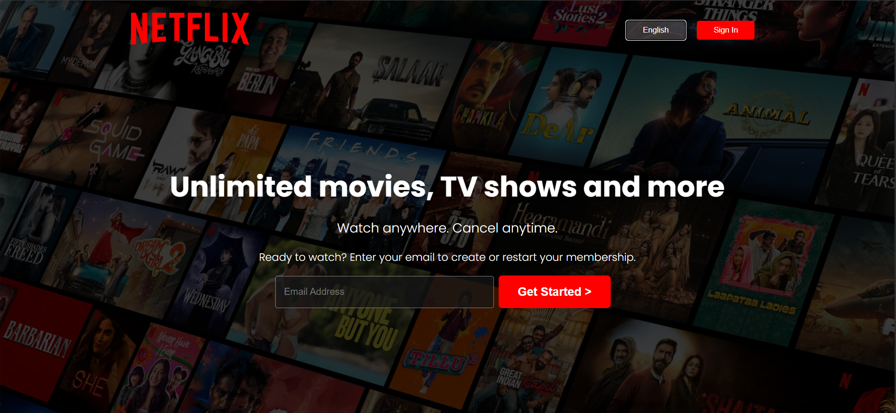

# Netflix Landing Page Clone 🎬

A responsive Netflix landing page clone built using **HTML** and **CSS**.  
This project mimics the official Netflix homepage design and layout.

## 📸 Preview

 <!-- Replace with actual path -->

## 🚀 Features

- Fully responsive layout for all devices
- Clean and modern design
- Pure HTML & CSS 
- Mobile-first design approach

## 📁 Project Structure

/Netflix-Landing-page-Clone
│
├── assets/
│ └── images/
├── index.html
├── style.css
└── README.md

## 🛠️ Technologies Used

- HTML5
- CSS3
- Flexbox
- Media Queries

## 📌 How to Run

1. Clone the repository  
   `git clone https://github.com/Nikki20049/Netflix-Landing-page-Clone.git`

2. Open `index.html` in your browser

## ✍️ Author

**Nikitha Pothanapalli** – [@Nikki20049](https://github.com/Nikki20049)

---

⭐ If you like it, give the repo a star!